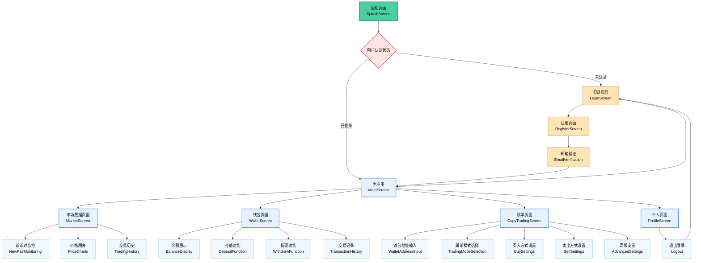
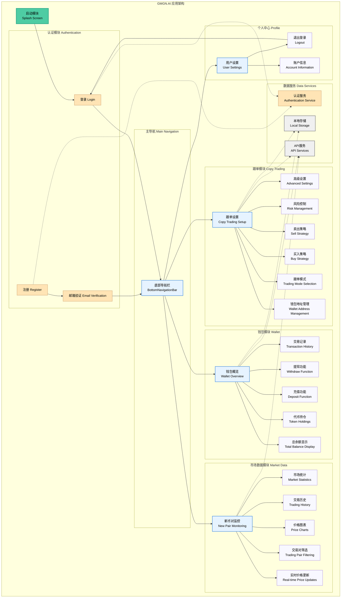
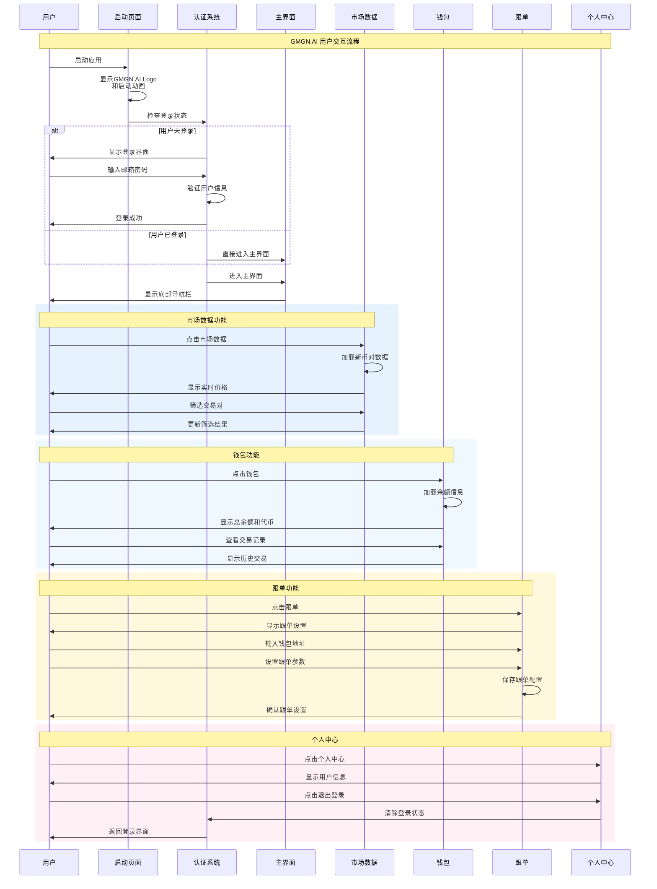

# GMGN.AI - 智能加密货币交易平台

<div align="center">
  
  
  
  
  
</div>

## 📱 应用简介

GMGN.AI 是一款专业的加密货币交易平台移动应用，提供实时市场数据监控、智能钱包管理和跟单交易功能。应用采用现代化的深色主题设计，为用户提供流畅的交易体验。

## ✨ 主要功能

### 🔐 用户认证系统

- 邮箱注册登录
- 邮箱验证码验证
- 用户数据持久化存储
- 安全的认证状态管理

### 📊 市场数据监控

- 实时新币对监控
- 价格图表展示
- 交易历史记录
- 市场统计数据
- 智能筛选功能

### 💰 钱包管理

- 多币种余额展示
- SOL、USDC、RAY 等主流代币支持
- 充值提现功能
- 详细交易记录
- 资产价值统计

### 🔄 跟单交易

- 钱包地址管理
- 多种跟单模式（闪电模式、极速上链）
- 灵活买入策略（最大跟买、固定金额、固定比例）
- 智能卖出设置（自动跟卖、不跟卖）
- 止盈止损配置
- 高级交易参数设置

### 👤 个人中心

- 用户信息管理
- 安全退出登录
- 简洁的用户界面

## 🎨 设计特色

- **GMGN 品牌风格**：采用标志性的绿色主题色彩 (#4ECCA3)
- **深色主题**：现代化的深色界面设计
- **响应式布局**：适配不同屏幕尺寸
- **流畅动画**：提升用户体验的交互动画
- **原生启动屏幕**：iOS 和 Android 原生启动效果

## 📋 页面流程图

### 1. 应用导航流程



### 2. 应用架构模块图



### 3. 用户交互时序图



## 🛠️ 技术栈

- **框架**: Flutter 3.32.4
- **语言**: Dart 3.8.1
- **状态管理**: Provider
- **网络请求**: Dio, HTTP
- **本地存储**: SharedPreferences
- **图表组件**: FL Chart
- **图像处理**: Cached Network Image
- **动画**: Flutter Animations
- **国际化**: Intl

## 📱 支持平台

- ✅ iOS 12.0+
- ✅ Android API 21+
- ✅ 响应式设计，支持各种屏幕尺寸

## 🚀 快速开始

### 环境要求

- Flutter SDK 3.32.4+
- Dart SDK 3.8.1+
- Android Studio / VS Code
- iOS: Xcode 15.0+ (仅 iOS 开发)
- Java 17+ (Android 开发)

### 安装步骤

1. **克隆项目**

   ```bash
   git clone <repository-url>
   cd flutter_app
   ```

2. **安装依赖**

   ```bash
   flutter pub get
   ```

3. **运行应用**

   ```bash
   # iOS模拟器
   flutter run -d ios

   # Android模拟器
   flutter run -d android

   # 查看可用设备
   flutter devices
   ```

### 构建发布版本

```bash
# Android APK
flutter build apk --release

# iOS IPA (需要在macOS上)
flutter build ios --release
```

## 📁 项目结构

```
lib/
├── main.dart                 # 应用入口
├── models/                   # 数据模型
│   ├── user.dart
│   └── trading_data.dart
├── screens/                  # 页面组件
│   ├── splash_screen.dart
│   ├── auth/
│   │   ├── login_screen.dart
│   │   └── register_screen.dart
│   ├── main_screen.dart
│   ├── market_screen.dart
│   ├── wallet_screen.dart
│   ├── copy_trading_screen.dart
│   └── profile_screen.dart
├── services/                 # 业务服务
│   ├── auth_service.dart
│   └── api_service.dart
└── widgets/                  # 通用组件
    ├── custom_button.dart
    └── loading_indicator.dart

assets/
├── images/                   # 图片资源
└── icons/                    # 图标资源
    └── app_icon.svg

android/                      # Android原生配置
ios/                         # iOS原生配置
```

## 🎯 开发路线图

- [x] 用户认证系统
- [x] 市场数据展示
- [x] 钱包功能
- [x] 跟单交易界面
- [x] 原生启动屏幕
- [x] 应用图标和品牌
- [ ] 实时数据推送
- [ ] 交易执行功能
- [ ] 多语言支持
- [ ] 深色/浅色主题切换
- [ ] 推送通知

## 🤝 贡献指南

1. Fork 项目
2. 创建功能分支 (`git checkout -b feature/AmazingFeature`)
3. 提交更改 (`git commit -m 'Add some AmazingFeature'`)
4. 推送到分支 (`git push origin feature/AmazingFeature`)
5. 开启 Pull Request

## 📄 许可证

本项目采用 MIT 许可证 - 查看 [LICENSE](LICENSE) 文件了解详情。

## 📞 联系我们

- 官网: [https://gmgn.ai](https://gmgn.ai)
- 邮箱: support@gmgn.ai
- Telegram: @GMGNAI

---

<div align="center">
  <p>由 ❤️ 和 Flutter 构建</p>
  <p>© 2024 GMGN.AI. All rights reserved.</p>
</div>
